# 技术文档

## 平台

服务端：ThinkPHP框架 + MySQL数据库

管理端：Web（ThinkPHP(PHP)+ jQuery + MDUI+ bootstrap）

预定端：Web、Android(Java ME)

会议室前端：C++/Qt框架 + 人脸识别SDK

## 环境

Server运行环境：PHPStudy

# MySQL数据库

（服务端）

## 数据库设计

本数据库中需要建立的数据表共6张，以下是这些数据表的详细说明。

1. 会议室信息表（room）：用于存放公司所有会议室数据
2. 管理员信息表（admin）：用于存放管理员数据
3. 用户信息表（user）：用于存放用户个人数据
4. 会议室租借表（lease）：用于存放用户与会议室的租约数据
5. 会议签到表（check）：用于存放与会人员到场情况数据
6. 会议笔记表（note）：用户存放用户对某场会议的记录数据

> 运行`application/sql/install.sql`来安装

## UML图

## 会议室 rooms

| 说明     | 字段名      | 类型    |
| -------- | ----------- | ------- |
| 索引     | room_id     | int     |
| 管理员   | admin_id    | int     |
| 名称     | name        | varchar |
| 栋       | building    | int     |
| 楼       | floor       | int     |
| 间       | num         | int     |
| 最大人数 | max         | int     |
| 话筒     | microphone  | boolean |
| 投影仪   | projection  | boolean |
| 价格     | price       | int     |
| 使用中   | using       | boolean |
| 维修中   | maintaining | boolean |
| 创建时间 | create_time | bigint  |
| 修改时间 | update_time | bigint  |

每个会议室都有位置，选择相距尽量远的会议室

如果栋楼都为空，那么主要用来判断的就是 num

**使用中**为这个会议室现在是不是正在使用（暂时没什么用）

## 管理员 admins

| 说明     | 字段名      | 类型    |
| -------- | ----------- | ------- |
| 索引     | admin_id    | int     |
| 账号     | username    | varchar |
| 密码     | password    | varchar |
| 昵称     | nickname    | varchar |
| 权限     | permission  | int     |
| 创建时间 | create_time | bigint  |
| 修改时间 | update_time | bigint  |

**权限**用来限制管理员账号是否能肆意修改

## 用户 users

| 说明     | 字段名      | 类型    |
| -------- | ----------- | ------- |
| 索引     | users_id    | int     |
| 账号     | username    | varchar |
| 密码     | password    | varchar |
| 昵称     | nickname    | varchar |
| 手机     | mobile      | varchar |
| 邮箱     | email       | varchar |
| 公司     | company     | varchar |
| 职位     | post        | varchar |
| 信用度   | credit      | int     |
| 创建时间 | create_time | bigint  |
| 修改时间 | update_time | bigint  |

每次借出结束后都会生成一个信用度，表示借出情况、损坏状况、整洁度等

如果出问题，会减少信用度

**信用度**高的，优先借出（如果有冲突的话）

## 租借表 lease

| 说明       | 字段名        | 类型     |
| ---------- | ------------- | -------- |
| 索引       | lease_id      | int      |
| 房间号     | room_id       | int      |
| 管理员     | admin_id      | int      |
| 借出人     | user_id       | int      |
| 开始时间   | start_time    | bigint   |
| 结束时间   | finish_time   | bigint   |
| 主题       | theme         | varchar  |
| 用途       | usage         | longtext |
| 留言       | message       | longtext |
| 场地打扫   | sweep         | boolean  |
| 现场招待   | entertain     | boolean  |
| 远程会议   | remote        | boolean  |
| 使用后环境 | circumstance  | varchar  |
| 管理员评分 | admin_score   | int      |
| 用户评分   | user_score    | int      |
| 信用度变化 | credit_change | int      |
| 创建时间   | create_time   | bigint   |
| 修改时间   | update_time   | bigint   |

从**开始时间**借出，结束时间必须结束，可以提前结束（真正结束时间）

留言可以说明是否需要饮品、座椅安排、其他特殊要求

使用后会进行评分、修改信用度，如果损坏情况严重，会降信用

可以申请场地打扫、现场招待服务，这需要会议室公司自行联系服务提供方

## 签到表 check

| 说明     | 字段名      | 类型    |
| -------- | ----------- | ------- |
| 索引     | check_id    | int     |
| 租约号   | lease_id    | int     |
| 用户号   | user_id     | int     |
| 已到     | checked     | boolean |
| 离开     | leave       | boolean |
| 创建时间 | create_time | bigint  |
| 修改时间 | update_time | bigint  |

## 笔记表 notes

| 说明     | 字段名      | 类型     |
| -------- | ----------- | -------- |
| 索引     | note_id     | int      |
| 租借号   | lease_id    | int      |
| 用户号   | user_id     | int      |
| 内容     | content     | longtext |
| 备注     | remark      | longtext |
| 创建时间 | create_time | bigint   |
| 修改时间 | update_time | bigint   |

# 系统基本配置

**客户端硬件配置：**

CPU主频1GHz以上，内存1GB以上，硬盘空间10G以上。

**软件运行环境：**

(1)   系统开发环境：Sublime Text3

(2)   数据库：MySQL5.5.53

(3)   服务器：腾讯云服务器

(4)   系统开发语言：PHP

(5)   前端开发框架：jQuery+Boostrap+MDUI

(6)   运行平台：Win7及以上系统版本

# 用户界面设计

#### 1、会议室负责人管理

​	使用主管理员账号方可进入此界面，可设置所有管理员（即会议室负责人）的账号信息。在主管理员账号登录后，管理员列表如图3.3.2.1所示。

​	在账号管理界面，可选择添加、编辑、删除账号。

​	添加账号，只需要提供管理员账号、昵称，即可快速加入到所在管理员中。每个管理员都需要设置不同的权限，分别为：只读、允许修改、允许删除、完整权限。只读管理员账号可查看所有会议室、管理员账号、用户账号信息，只有拥有完整权限的主管理员账号才能修改其他管理员账号。
同样的，在管理员账号管理界面，可以编辑管理员信息、删除管理员账号等。由于使用ThinkPHP5的MVC模式架构，后期可快速扩展管理员的手机号、邮箱等实名信息。

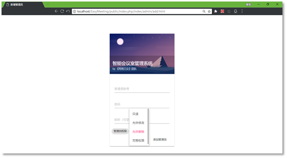

#### 2、会议室管理

​	从最顶端菜单的“房间管理”入口进入会议室管理。所有管理员账号皆拥有查看所有会议室信息的权限。而如果要修改会议室信息，则需要“修改”权限；如果要删除或者添加会议室，需要“删除”权限。

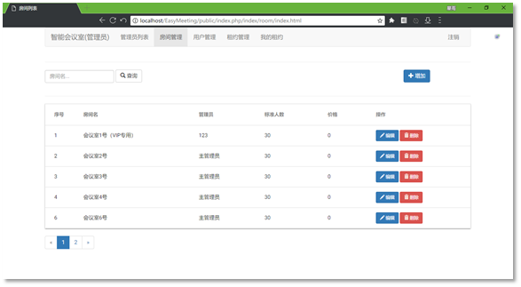

​	每一个会议室都有自己对应的管理员，即负责人，可以使用相应权限的管理员账号修改相关信息。在会议室编辑界面中，列出所有的管理员账号供选择，如图3.3.2.4。能够自定义会议室名字用以分辨，而不是简单的门牌号。还可以设置最大人数，供在智能选择会议室的时候选择人数最恰当的会议室，用来腾出更多人数较多的会议室供其他用户使用。

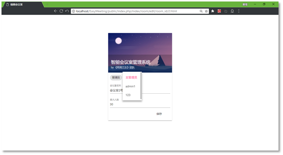

#### 3、用户账号管理

​	使用管理员账号登录可以看到用户的账号信息，包括用户名、昵称、信用度、租借的会议室等。图3.3.2.5为在管理员视图下的用户账号列表。

​	信用度系统为EasyMeeting专门为解决会议室冲突问题打造的功能，每次用户租借会议室并使用完成后，会议室相关负责人会对用户的使用情况进行打分，用户所得分数将会累加。当会议室资源不足时，后台会自动选择信用度最高的用户，其余用户依次延后。

​	使用相应权限的管理员账号，可以编辑用户信息，包括用户名、用户密码、用户昵称等。由于使用ThinkPHP5的MVC模式架构，后期可快速扩展用户账号的手机号、邮箱等实名信息。

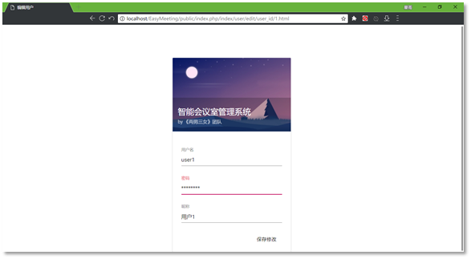

#### 4、租约订单管理

​	每一条会议室租借信息都包含大量的信息，其中包括：用户ID、会议室ID、管理员ID、开始时间、结束时间、会议主题、会议用途、会议留言、以及额外三项服务，即场地清理、现场招待、远程会议服务。

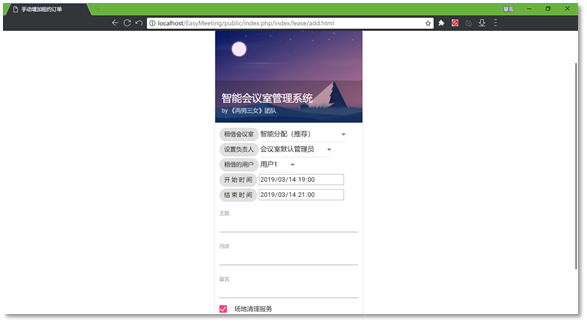

​	管理员账号登录后，从菜单中点进去，可以看到所有的会议室租约信息，用户ID、会议室ID等数据库主键字段则转化为相应的名字，如图3.3.2.8所示。

​	会议时间采用国际标准时间规则的11位时间戳存储，不受地区影响，全球通用。会议主题为本次会议的主题，也是一条租约的标题。用途说明了会议的具体信息，供与会人员进行参考。用途是租借者对会议室负责人的留言，包括了对目标会议室的特殊需求，如座位安排、饮料提供等，不会在会议室租约列表中公开显示。

​	EasyMeeting同样提供了关键词过滤功能，支持针对会议室ID、会议室名称、具体时间、会议主题、用途和留言进行筛选，快速找到需要的记录。

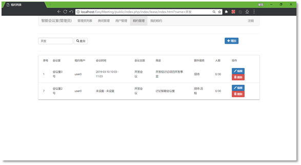

#### 5、负责人的租约

​	每一位管理员，都可以是会议室的负责人；同时每一个会议室也至少要有一个负责人，来负责会议室的租借事宜，以及最后的租借评分工作，并且人工处理会议途中的突发事件。管理员账号登录，在菜单“我的租约”中可以看到自己负责的所有会议租约。

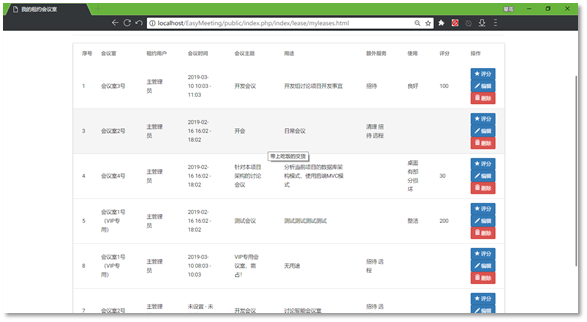

​	作为负责人，除了需要到现场控制会议的租借流程，还需要在事后针对会议环境情况进行打分、评级。每一条租约默认为100分，会议室负责人在盘查场地情况后，给予本次租借的用户一定分数，此分数会纳入用户的信用度。信用度越高，在会议室资源紧张时接到会议室的几率就越大。同时，如果用户租借的会议室房间出现大幅度的损坏，或者出现会议拖延到很晚的情况，那么管理员可针对该用户进行一定的负评分，当评分低于0时，用户账号将处于冻结状态，无法再进行租约，直到管理员手动修改用户信用度。下图为租约评分。

## 3.4 预定端设计

### 3.4.1 Web端

#### 1、用户登录/注册

​	在浏览器中输入EasyMeeting的官方网址，如果没有登录的话，会进入用户登录界面，如图3.4.1.1所示，要求输入账号、密码。

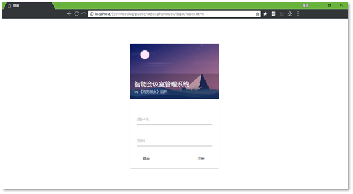

​	后台会自动判断管理员账号还是用户账号，不用特意分开。点击登录，即可进入相应的界面，管理员默认进入会议室房间管理界面，用户默认进入会议室租约订单界面。点击注册，跳转到用户注册页面，如图3.4.1.2所示。仅预定端用户支持自主注册，管理员（会议室负责人）账号需要使用主管理员账号手动添加。

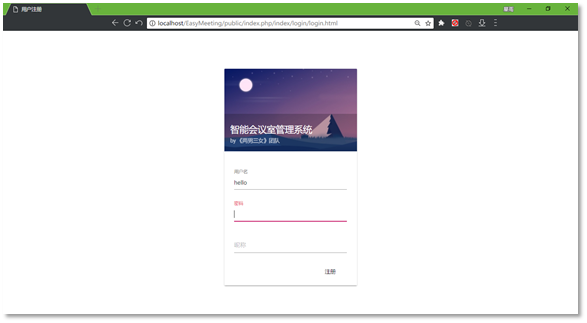

#### 2、会议室租约

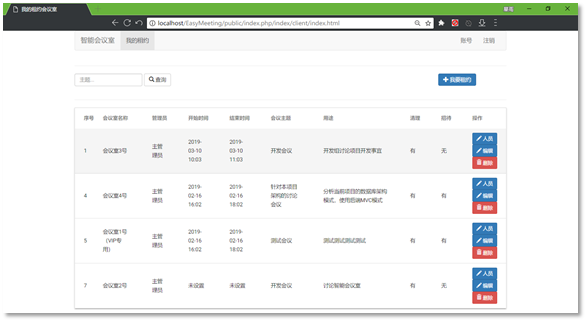

​	用户账号登录后，默认进入会议室租约界面，按照时间顺序从新到旧依次排列。每条租约都会显示序号、会议室名称、会议室负责人、会议时间、会议主题、具体用途、以及额外服务等信息。在最后边的操作栏，有三个按钮，分别是：人员、编辑、删除，可以编辑与会人员、编辑租借信息、删除租借。
​	点击右上方的“我要租约”，可以新建一条会议室租约订单，所需信息如图3.4.1.3所示。

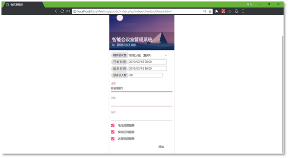

​	EasyMeeting着重设计了便捷的会议室租借流程，租借的会议室默认是“智能分配”，即不需要用户手动选择，一切都由系统后台自动筛选最合适的会议室，并分配相应的会议室负责人。

​	会议主题、具体用途会显示在租约列表中，而留言一项则只有对应的会议室负责人和主管理员账号才能看到。表单最后的三项服务：场地清理服务、现场招待服务、远程会议服务，则为本系统提供了与外公司合作的扩展接口，可以大幅度减少后期添加功能的成本，增强本系统的可扩展性。

​	点击列表最后边的编辑一项，则是编辑信息，对应信息与添加相同，这里就不再重复阐述。

#### 3、提前结束

​       为了准确判断哪些会议室是空闲的，让会议室资源利用得更高效，同时更加灵活，EasyMeeting提供了“提前结束”功能，如图3.4.1.4所示。点击“提前结束”，那么该会议室会立即判定为使用完毕，经过延后半小时的清理时间后，就可以重新投入使用，被其他人租借。而如果租借者没有点击提前结束，将会默认使用租约信息上的结束使用。

#### 4、添加与会人员

​	在每条租约的后面，都有一个“人员”按钮，这里可以添加或者编辑本次会议的人员，人员ID可以从已有的租约中复制而来。而如果第一次租约的话，可以点击“邀请”按钮，让与会人员自主参与进来，后续可直接添加到新的会议签到表中。

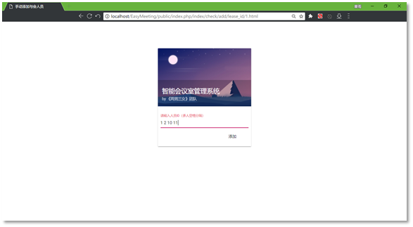

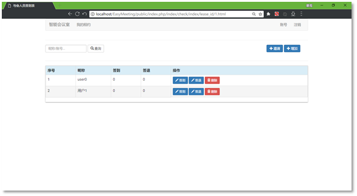